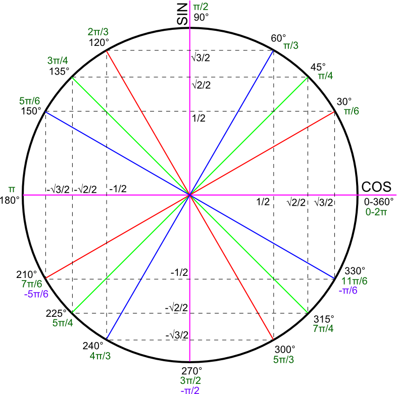

# Gestion de Particule

## Le Concept

Le but est de créer un générateur de particule.

Ce générateur de particule pourra servir à créer **différents effets complexes** (explosions, feu, pluies ...) et sera complété par différentes "extensions" tel que l'ajout de la gravité, d'une "durée de vie" à chaque particule, d'un "générateur de forme" pour générer des particules sur une forme carré, rectangulaire, ronde; de collisions, d'une interface pour changer les paramètres en cours et de plusieurs optimisation mémoire.


## Utiliser notre programme

Pour lancer notre programme, il suffit de lancer le fichier "project-particles" sous Linux avec la commande : 
```sh 
./project-particles
```

## Tester le Projet

Pour vérifier un projet, il est important d'écrire des tests et de les valider.
Pour faire cela, il faut faire la commande, sous Linux : 
```sh
go test ./particles
```
## Changer de prérélage
Pour changer de preset et avoir un résultat différent, il faut changer le nom du .json en **config.json**.
Ainsi, renommer config.json en config3.json et inversemment permet de changer de résultat.

* config.json
* config2.json
* config3.json
* config4.json
* config5.json
* config6.json
* config7.json

### **Utiliser l'Interface Graphique**
Lors du lancement du programme, vous rencontrerez l'interface graphique.
Elle sert à **paramétrer le programme**, en cliquant sur les boutons et les champs-textes correspondant sur **l'interface graphique**.
C'est la méthode la plus simple.

Les paramètres sont divisés en 4 parties :
* Paramètres Image
* Paramètres Générateur
* Paramètres Programme
* Paramètres Particule


Les différents paramètres correspondent exactement aux différents arguments du config.json que vous verrez dans le chapitre d'après.

### **Modifier le config.json**
Si vous ne voulez pas utiliser l'interface graphique, la méthode la plus efficiente est de **modifier le fichier config.json.
    
Elle permet de modifier toutes les variables (vitesse, taille de l'écran, taille, _SpawnRate_ ...).
```json
{
	"WindowTitle": "Release Projet Particules - Bryan & Clément",
	"WindowSizeX": 1280,
    "WindowSizeY": 720,
	"ParticleImage": "assets/particle2.png", 
	"Debug": true,
	"InitNumParticles": 200,
	"RandomSpawn": false,
	"SpawnX": 640,
	"SpawnY": 360,
	"SpawnRate":0.9,
	"ColorRed": 200,
	"ColorGreen": 200 ,
	"ColorBlue": 200,
	"ScaleX": 0.32,
	"ScaleY": 0.32,
	"Opacity": 1,
	"Velocity": 5,

	"Gravity": 0.01,
	"Margin": 100,
	"Flag": 0,
	"LifeSpanMax":2,
	"GeneratorShape":"eclipse",
	"CustomImageBool":true,
	"CustomImageSRC":"assets/earth.png",
	"Collision":false,
	"SizeShape":5,
	"MouseClick":true
}
```


### **Afficher les IPS**

Le paramètre **Debug** sert à afficher les Images Par Secondes :
```json
    "Debug": true
```
### **Activer ou Désactiver l'Apparition Aléatoire**
Le paramètre **RandomSpawn** sert à faire apparaitre les particules en un point (le centre) ou les faire apparaître de manière aléatoire :
```json
    "RandomSpawn": false
```
### **Changer les propriétés des particules**
Ces propriétés regissent l'apparence des particules, mais pour l'instant, ces paramètres ne changent pas en cours de route.
```json
	"ColorRed": 200,
	"ColorGreen": 200 ,
	"ColorBlue": 200,
	"ScaleX": 0.32,
	"ScaleY": 0.32,
	"Opacity": 1,
	"Velocity": 5
```
### **Afficher une image dans le système de particule**
Le programme permet d'afficher une image grâce au système de particule.
Pour cela, il faut modifer deux valeurs :
```json
	"CustomImageBool":true,
	"CustomImageSRC":"assets/earth.png",
```
CustomImageBool sert à définir si on doit, ou non, afficher une image.
```json
	"CustomImageBool":true,
```
customImageSRC correspond simplement au chemin relatif de notre image ( qui, d'ailleurs, ne peut être que en .png ).
```json
	"CustomImageSRC":true,
```

### **Changer la forme du générateur**
Vous pouvez changer la forme avec laquelle sera généré chaque particule.
Pour cela il faut modifier le champ GeneratorShape et SizeShape du config.json.
```json
	"GeneratorShape":"eclipse",
	"SizeShape":5
```
Il existe 4 formes différentes de générateur :
* cercle
* carre
* rectangle
* eclipse

SizeShape quant à lui sert à modifier la taille de la zone dans lequel apparaîtront les particules.


## Structure du Projet
Le projet est contenu dans **3 dossiers** :

Le premier dossier contient l'image que chaque particule utilise, et le code pour l'ouvrir.

* assets :
* * getassets.go
* * particle2.png
* * particle3.png  
* * ...

Le deuxième dossier contient **getconfig.go** dont le but est de lire le fichier **config.json** et le fichier **type.go** dont le but est de définir la structure du fichier json.
* config :
*   * getconfig.go
*   * type.go

Et finalement le dossier particles contient le fichier **new.go** qui crée les premières particules à apparaitre, **type.go** qui définit la structure particule, **update.go** qui est appelé 60 fois par seconde et qui met à jour les propriétés des particules et finalement **funcAdd.go** et **funcAdd_test.go** qui sont de *nouveaux fichiers* et contiennent une partie des fonctions utilisés dans d'autres fichiers.
**image.go**, lui, sert à transformer une image en quelque chose d'utilisable avec la bibliothèque Ebiten, et de récupérer chaque couleur de chaque pixel de la même image, et de les mettre dans une liste.
* particles :
*   * funcAdd_test.go
*   * funcAdd.go
*	* image.go
*   * new.go
*   * type.go
*   * update.go

## Fichier config/type.go

Voici le fichier de configuration de chaque particule. Une particule aura tous ces paramètres à sa création.

```golang
type Particle struct {
	PositionX, PositionY            float64
	Rotation                        float64
	ScaleX, ScaleY                  float64
	ColorRed, ColorGreen, ColorBlue float64
	Opacity                         float64
	SpeedX, SpeedY                  float64
	LifeSpan                        int 
	IsInLife						bool
	Angle							float64
}
```
### Paramètres de mouvement
PositionX, positionY, Rotation et ScaleX, ScaleY sont les paramètres **de mouvement** d'une particule. Il faut jouer avec ces paramètres pour créer des particules persnnalisés.
```golang
	PositionX, PositionY            float64
	Rotation                        float64
	ScaleX, ScaleY                  float64
```
### La vitesse

SpeedX et SpeedY sont les paramètres **de vitesse** de chaque particule, pour rappel, 
une vitesse en X *positive* désigne une particule qui **va à droite**, et une particule avec une vitesse en Y *positive* désigne une particule qui **descend**.
```golang
	SpeedX, SpeedY                  float64
```
### Durée de vie
La durée de vie en 1/60e de seconde.

Elle sert à calculer la gravité, et si une particule doit être supprimé car elle est trop vieille.

```golang 
	LifeSpan                        int 
```
### IsInLife
Sert à définir sur une particule est en vie ou non.
Utilisé pour le système de recyclage ou, si on a besoin de faire apparaître une nouvelle particule, on utilise une des particules "mortes"
```golang
	IsInLife						bool
```
### Angle
Angle en radian. Correspond au cercle trigonométrique, et donc, comme le cercle trigonométrique, 0 correspond à une direction vers la droite, et une direction "vers la gauche" correspond à un Pi.
```golang 
	Angle							float64
```



## Fichier particles/fundAdd.go
Nouveau fichier, il contient la majorité des fonctions utilisés dans tous le projet.
```golang
func puissance2(a float64) float64 {
}

func placeParticleInLs(particule *list.Element, s *System) {
}

func createNParticles(nb int, s *System) {
}

func shapePropriete(p *Particle) {
}

func collisionWall(p *Particle) {
}

func collisionBetweenParticles(e *list.Element) {
}

func setColor(p *Particle) {
}

func IsOutOfView(e *list.Element, p *Particle, s System) {
}

func LifeSpanIsTooAged(ele *list.Element, p *Particle, s System) {
}

func setInvisible(p *Particle) {
}

func KeyboardInput(p *Particle) {
}
```
### Fonction placeParticleInLs
Sert à "ranger" une particule dans une liste en fonction de sa position X.
Sert principalement à gérer les collisions intra-particules.
```golang
func placeParticleInLs(particule *list.Element, s *System) {
	var p *Particle = particule.Value.(*Particle)
	var posXBefore float64 = 0
	var maParticule *Particle //Particules dans la liste s.Content
	for e := s.Content.Front(); e != nil && e.Value.(*Particle).IsInLife; e = e.Next() {
		maParticule = e.Value.(*Particle)
		if posXBefore >= p.PositionX {
			s.Content.MoveBefore(particule, e)
			return
		}
		posXBefore = maParticule.PositionX
	}
	s.Content.MoveToBack(particule)
}
```
### Fonction createNParticles
Une des plus grandes fonctions de ce fichier.
Sert principalement à **créer un certain nombre de particule** donné en argument dans un système, aussi donné en argument.

La fonction crée une nouvelle particule si il n'y pas de particules mortes disponibles et sinon, pioche dans la liste des particules mortes pour en faire une particule vivante.
C'est le composant principal du **système de recyclage de particules** ou les particules qui sont en dehors de l'écran ou trop vieilles sont considérés comme "mortes", et donc, plus mis à jour.
```golang
rand.Seed(time.Now().UnixNano())

	for i := 0; i < nb; i++ {
		var posX float64 = float64(config.General.SpawnX)
		var posY float64 = float64(config.General.SpawnY)

		Opacity := config.General.Opacity
		var speedX float64 = rand.Float64() * config.General.Velocity
		var speedY float64 = rand.Float64() * config.General.Velocity
		var signe []int = []int{-1, 1}
		speedX = speedX * float64(signe[rand.Intn(2)])
		speedY = speedY * float64(signe[rand.Intn(2)])
		var angleP float64
		if config.General.GeneratorShape == "triangle" {
			var angle float64 = float64(rand.Intn(360))
			angleP = (angle * math.Pi) / 180
			n := 3
			if n > 2 {
				mul_angle := 0
				for angle-float64((360/n)*mul_angle) > float64(((360 / n) / 2)) {
					mul_angle = mul_angle + 1
				}
				speedX = speedX / math.Cos(((angle-float64(360/n)*float64(mul_angle))*math.Pi)/180)
				speedY = speedY / math.Cos(((angle-float64(360/n)*float64(mul_angle))*math.Pi)/180)

			}
... ( la fonction fait + 150 lignes )
```
### Fonction shapePropriete
Sert à gérer la forme "eclipse" que l'on peut changer du paramètre GeneratorShape du config.json.
```golang
func shapePropriete(p *Particle) {
	if config.General.GeneratorShape == "eclipse" {
		var a float64 = math.Sqrt(puissance2((p.PositionX - float64(config.General.SpawnX))) + puissance2((p.PositionY - float64(config.General.SpawnY))))
		if a < config.General.SizeShape*10 {
			p.Opacity = 0
		} else {
			if a > config.General.SizeShape*10+(config.General.SizeShape*20)/100 {
				p.Opacity = p.Opacity - 0.1
			} else {
				p.Opacity = 1
			}
		}
	}
}
```
### Fonction collisionWall
Sert à faire en sorte que si une particule touche un mur sa vitesse change de signe, et donc, aille dans l'autre sens.

```golang
func collisionWall(p *Particle) {
	var x, y int = assets.ParticleImage.Size()
	
	if (p.PositionX+float64(x)*config.General.ScaleX) >= float64(config.General.WindowSizeX) || p.PositionX <= 0 {
		p.SpeedX = -p.SpeedX
	}
	if (p.PositionY+float64(y)*config.General.ScaleY) >= float64(config.General.WindowSizeY) || p.PositionY <= 0 {
		p.SpeedY = -p.SpeedY
	}
}
```
### Fonction setColor
**Système de génération de drapeau** en fonction de la valeur de "flag" du config.json.
Changer la variable de 1 à 10 permettra de faire apparaitre le drapeau FR,IT,IR,BEL,RO,IN,DE,JAP,RU,UA ...

Gère aussi la couleur d'un pixel en fonction de la position. En effet, on peut aussi importer une image et faire changer la couleur d'un pixel en fonction d'elle.
```json
	"CustomImageBool":false,
	"CustomImageSRC":"assets/BobbyFace.png"
```
Pour ceci il faut mettre le paramètre "CustomeImageBool" du fichier config.json à true et dans CustomImageSRC il faut mettre le lien relatif de notre image.

```golang
func setColor(p *Particle) {
	if config.General.CustomImageBool {
		config.General.ColorBlue = 0
		config.General.ColorGreen = 0
		config.General.ColorRed = 0
		if len(ImageColorls) < 1 {
			ImageColorls = getListColor(config.General.CustomImageSRC)
		}
		var lenX, lenY int = len(ImageColorls[0]), len(ImageColorls)
		if p.PositionX > 0 && int(p.PositionX) < lenX && p.PositionY > 0 && int(p.PositionY) < lenY {
			var color []float64 = ImageColorls[int(p.PositionY)][int(p.PositionX)]
			var r, g, b, _ uint32 = uint32(color[0]), uint32(color[1]), uint32(color[2]), uint32(color[3])
			p.ColorRed = float64(r) / 65535
			p.ColorGreen = float64(g) / 65535
			p.ColorBlue = float64(b) / 65535
		}
	}
	var param int = config.General.Flag

	//color
	var b1 []float64 = []float64{0, 0, 255}
	var blanc []float64 = []float64{255, 255, 255}
	var r1 []float64 = []float64{255, 0, 0}
	
	var France [][]float64 = [][]float64{b1, blanc, r1}

	switch param {
	case 1:
		//FRANCE
		if p.PositionX < 427 {
			p.ColorRed = France[0][0] / 255
			p.ColorGreen = France[0][1] / 255
			p.ColorBlue = France[0][2] / 255
		} else if p.PositionX < 853 {
			p.ColorRed = France[1][0] / 255
			p.ColorGreen = France[1][1] / 255
			p.ColorBlue = France[1][2] / 255
		} else {
			p.ColorRed = France[2][0] / 255
			p.ColorGreen = France[2][1] / 255
			p.ColorBlue = France[2][2] / 255
		}
	}
```
### Fonction IsOutOfView
Cette fonction va tout simplement **vérifier les coordonnées d'une particule** pour savoir si elle doit **être supprimé ou non**.

Si la coordonnées n'est pas dans la partie visible du programme plus notre "margin" alors 
on met son paramètre "IsInLife" à false et on rajoute cette particule à la liste des particules mortes et on appelle la fonction setInvisible.

```golang
func IsOutOfView(e *list.Element, p *Particle, s System) {
	if p.PositionX < -config.General.Margin || p.PositionX > float64(config.General.WindowSizeX)+config.General.Margin || p.PositionY > float64(config.General.WindowSizeY)+config.General.Margin {
		s.Content.MoveToBack(e)
		p.IsInLife = false
		s.NbParticulesMortes++
		setInvisible(p)
	}
}
```
### Fonction LifeSpanIsTooAged
Cette fonction va regarder le paramètre "LifeSpan" que chaque particule possède et va le comparer avec le paramètre "LifeSpanMax" de config.json.
Si la durée de vie est trop élevée, pareil, on la considère comme morte, on la rajoute à la liste des particules mortes et on appelle, comme précedemment, la fonction setInvisible.
```golang
func LifeSpanIsTooAged(ele *list.Element, p *Particle, s System) {
	if config.General.LifeSpanMax <= float64(p.LifeSpan)/60 {
		s.Content.MoveToBack(ele)
		s.NbParticulesMortes++
		p.IsInLife = false
		setInvisible(p)
	}
}
```
### Fonction setInvisible
Le rôle de la fonction setInvisible est tout simplement de réduire l'opacité d'une particule à 0 et de la positionner en dehors de l'écran visible.
```golang
func setInvisible(p *Particle) {
	p.Opacity = 0
	p.PositionX = float64(config.General.WindowSizeX) + 500
}
```
### Fonction KeyboardInput
Elle lit l'entrée clavier et le rajoute à un string (KeyStringNew).
En fonction du string envoyé, l'action faite n'est pas la même.
Ainsi si on a un string composé d'entier, alors une des variables de config.json verra sa valeur varier;
mais si le string contient des caractères spéciaux comme le "#" ou le "^",
alors des actions spéciales peuvent apparaitre, comme la touche échap qui n'enregistre pas la string à envoyer, ou la touche entrée qui sauvegarde et enregistre la valeur.
```golang
func KeyboardInput() {

	var key string
	if inpututil.IsKeyJustPressed(ebiten.KeyDigit0) || inpututil.IsKeyJustPressed(ebiten.Key0) || inpututil.IsKeyJustPressed(ebiten.KeyNumpad0)  {
		key = "0"
	}
	if inpututil.IsKeyJustPressed(ebiten.KeyDigit1) || inpututil.IsKeyJustPressed(ebiten.Key1) || inpututil.IsKeyJustPressed(ebiten.KeyNumpad1)   {
		key = "1"
	}
		if key == "0" || key == "1" || key == "2" || key == "3" || key == "4" || key == "5" || key == "6" || key == "7" || key == "8" || key == "9" || key == "." {
		KeyStringNew = KeyStringNew + key
	}
	if key == "backspace" { //si on appuie sur la touche retour arrière ( la flèche qui pointe vers la gauche), on supprime le dernier élément du string
		if len(KeyStringNew) >= 1 {
			KeyStringNew= string(KeyStringNew[:len(KeyStringNew)-1])
		}
	}
	if key == "escape" {
		KeyStringNew = KeyStringNew + "^"
	}
	if key == "enter" {
		KeyStringNew = KeyStringNew + "#"
	} 
	...
```
